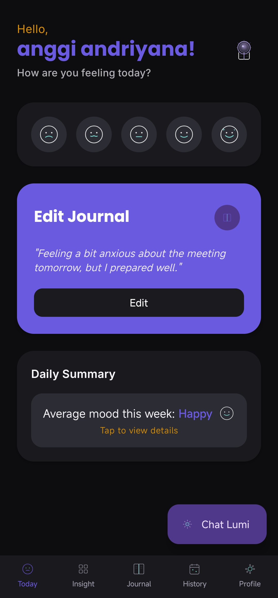
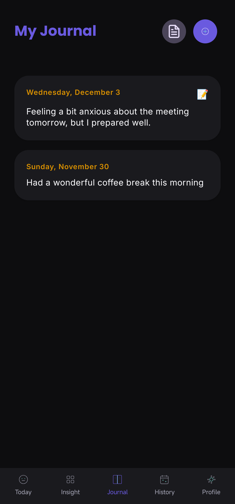
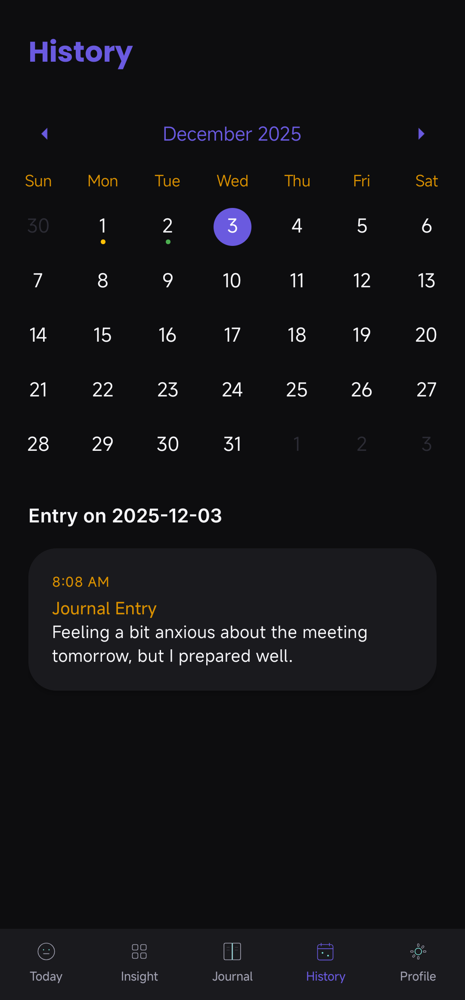

# 📔 Lumina Lite - Open Source AI Journal

<div align="center">


**A Beautiful, Open-Source Mood Journal App Built with React Native**

Transform your daily thoughts into meaningful mood insights with an elegant, minimalist journaling experience.

[](https://github.com/anggi1991/lumina-lite)
[](LICENSE)
[](https://reactnative.dev/)
[](https://expo.dev/)
[](https://www.typescriptlang.org/)

[✨ Features](#-features) • [📸 Screenshots](#-screenshots) • [🛠️ Tech Stack](#️-tech-stack) • [🚀 Getting Started](#-getting-started) • [🎨 UI Preview](#-ui-preview)

</div>

---

## 📖 About

**Lumina Lite** is an open-source mood journaling application that helps users track their emotions and reflect on daily experiences. With a clean, intuitive interface and thoughtful design, it makes journaling a habit worth building.

This is the **community edition** of Lumina—perfect for developers, designers, and mood-tracking enthusiasts who want to contribute, customize, or simply explore a well-crafted React Native application.

### Why Lumina Lite?

- 🎯 **Learning Resource** - Great example of modern React Native architecture
- 🧩 **Extensible** - Easy to add new features and integrations
- 🎨 **Beautiful UI** - Production-ready Material Design 3 components
- 📚 **Well-Documented** - Clear code with TypeScript types
- 🔓 **Open Source** - MIT licensed, community-driven

---

## ✨ Features

### Core Features
- ✍️ **Intuitive Journaling** - Quick mood capture with text journaling
- 🎭 **5-Level Mood Picker** - Angry → Sad → Neutral → Happy → Excited
- 📝 **Rich Text Support** - Write detailed journal entries with ease
- 🏷️ **Smart Tagging** - Categorize entries with custom tags
- 📅 **Timeline View** - Browse your journal history chronologically
- 📊 **Mood Analytics** - Visualize your emotional patterns
- 💾 **Local Storage** - All data stored locally on your device (no cloud sync)
- 🎨 **Beautiful UI** - Modern design with smooth animations
- 🌙 **Dark Mode** - Eye-friendly dark theme support

### What's NOT Included (Lite Version)
- ❌ AI-powered mood insights
- ❌ Cloud synchronization
- ❌ Multi-device sync
- ❌ Subscription/Premium features
- ❌ Backend authentication
- ❌ In-app purchases

---

## 📸 Screenshots

<div align="center">
  
  
  
  
</div>

---

## 🛠️ Tech Stack

### Frontend
```
React Native 0.75.4
├── Expo SDK 52
├── TypeScript 5.0
├── React Navigation 6
├── React Native Paper 5 (Material Design 3)
├── React Native SVG (Custom Charts)
└── Async Storage (Local persistence)
```

### State Management & Hooks
```
React Context API
├── Theme Context (Light/Dark Mode)
└── Custom Hooks (useFocusEffect, etc.)
```

### UI/UX
```
Material Design 3 Components
├── Custom Icons (SVG-based)
├── Smooth Animations (React Native Reanimated)
├── Responsive Layouts
└── Accessibility Features
```

### Developer Tools
```
ESLint + Prettier
├── Code formatting
├── Type checking (TypeScript)
└── Development utilities
```

---

## 🎨 Design System

This project implements a **custom Material Design 3** color system:

```
Primary Color:    #6A5AE0 (Deep Purple)
Secondary Color:  #D99000 (Warm Orange)
Tertiary Color:   #7CB342 (Green)
Success Color:    #4CAF50
Warning Color:    #FFC107
Error Color:      #F44336

Mood Colors:
├── Angry:        #F44336 (Red)
├── Sad:          #42A5F5 (Blue)
├── Neutral:      #9E9E9E (Gray)
├── Happy:        #FFD54F (Yellow)
└── Excited:      #FF5722 (Orange-Red)
```

Check `src/constants/theme.ts` for the complete design tokens.

---

## 🏗️ Project Structure

```
lumina-lite/
├── src/
│   ├── components/              # Reusable UI components
│   │   ├── icons/              # Custom SVG icons
│   │   └── ui/                 # UI components (buttons, cards, etc.)
│   ├── screens/                # Main app screens
│   │   ├── HomeScreen.tsx      # Main dashboard
│   │   ├── JournalEntryScreen.tsx
│   │   ├── JournalListScreen.tsx
│   │   ├── AnalyticsScreen.tsx
│   │   └── ...
│   ├── navigation/             # Navigation configuration
│   │   └── MainTabNavigator.tsx
│   ├── constants/              # App constants
│   │   ├── theme.ts           # Design tokens
│   │   └── mood.ts            # Mood definitions
│   ├── utils/                  # Helper functions
│   │   ├── date.ts            # Date utilities
│   │   ├── mood.ts            # Mood-related helpers
│   │   └── storage.ts         # Local storage helpers
│   ├── types/                  # TypeScript type definitions
│   │   └── journal.ts
│   ├── i18n/                   # Internationalization
│   │   ├── index.ts
│   │   └── locales/           # Language files
│   ├── App.tsx                 # Root component
│   └── index.ts
├── assets/                     # Images and icons
├── app.json                    # Expo configuration
├── tsconfig.json              # TypeScript configuration
├── package.json
└── README.md
```

---

## 🚀 Getting Started

### Prerequisites

- **Node.js** >= 18.x
- **npm** or **yarn**
- **Expo CLI** - [Install here](https://docs.expo.dev/get-started/installation/)
- **Expo Go App** - Download from [App Store](https://apps.apple.com/app/expo-go/id982107779) or [Google Play](https://play.google.com/store/apps/details?id=host.exp.exponent)

### Installation

```bash
# 1. Clone the repository
git clone https://github.com/anggi1991/lumina-lite.git
cd lumina-lite

# 2. Install dependencies
npm install

# 3. Start the development server
npx expo start

# 4. Scan the QR code with your phone
# - iOS: Open Camera app and scan
# - Android: Open Expo Go app and scan
```

### Running on Emulator

```bash
# Android Emulator
npx expo start
# Press 'a' in the terminal

# iOS Simulator (macOS only)
npx expo start
# Press 'i' in the terminal
```

---

## 📱 Building for Production

### Android (APK)

```bash
# Build APK
eas build --platform android --profile production

# Or use Expo Go for quick testing
npx expo start --no-dev --minify
```

### iOS

```bash
# Build IPA
eas build --platform ios --profile production
```

### Note: Prerequisites for EAS Build
1. Create [Expo account](https://expo.dev/signup)
2. Install EAS CLI: `npm install -g eas-cli`
3. Authenticate: `eas login`
4. Configure project: `eas build:configure`

---

## 📚 Code Examples

### Creating a Journal Entry

```typescript
// src/screens/JournalEntryScreen.tsx
import React, { useState } from 'react';
import { View, TextInput } from 'react-native';
import { Button } from 'react-native-paper';

export default function JournalEntryScreen() {
  const [mood, setMood] = useState<'angry' | 'sad' | 'neutral' | 'happy' | 'excited'>('neutral');
  const [content, setContent] = useState('');

  const handleSave = async () => {
    const entry = {
      id: Date.now().toString(),
      mood,
      content,
      date: new Date().toISOString(),
      tags: [],
    };

    // Save to local storage
    const stored = await AsyncStorage.getItem('journal_entries');
    const entries = stored ? JSON.parse(stored) : [];
    entries.push(entry);
    await AsyncStorage.setItem('journal_entries', JSON.stringify(entries));
  };

  return (
    <View style={{ flex: 1, padding: 16 }}>
      {/* Mood Picker */}
      <MoodPicker selected={mood} onChange={setMood} />

      {/* Text Input */}
      <TextInput
        value={content}
        onChangeText={setContent}
        placeholder="What's on your mind?"
        multiline
        numberOfLines={8}
      />

      {/* Save Button */}
      <Button mode="contained" onPress={handleSave}>
        Save Entry
      </Button>
    </View>
  );
}
```

### Accessing Stored Data

```typescript
// src/utils/storage.ts
import AsyncStorage from '@react-native-async-storage/async-storage';

export async function getJournalEntries() {
  const stored = await AsyncStorage.getItem('journal_entries');
  return stored ? JSON.parse(stored) : [];
}

export async function saveJournalEntry(entry: JournalEntry) {
  const entries = await getJournalEntries();
  entries.push(entry);
  await AsyncStorage.setItem('journal_entries', JSON.stringify(entries));
}
```

---

## 🧪 Testing

```bash
# Run linter
npm run lint

# Format code
npm run format

# Check TypeScript
npm run type-check
```

---

## 🎓 Learning Resources

This project is great for learning:

- **React Native Basics** - Component-based architecture
- **React Hooks** - Custom hooks and Context API
- **Navigation** - React Navigation with bottom tabs
- **Local Storage** - AsyncStorage for persistence
- **TypeScript** - Type-safe React development
- **Material Design** - Design system implementation
- **State Management** - Context API patterns

### Key Files to Study

1. **`src/App.tsx`** - App root and theme setup
2. **`src/navigation/MainTabNavigator.tsx`** - Navigation structure
3. **`src/screens/HomeScreen.tsx`** - Main dashboard logic
4. **`src/constants/theme.ts`** - Design tokens
5. **`src/utils/storage.ts`** - AsyncStorage patterns

---

## 🤝 Contributing

We'd love your contributions! Whether it's bug fixes, new features, or documentation improvements.

### How to Contribute

1. **Fork the repository**
   ```bash
   git clone https://github.com/YOUR_USERNAME/lumina-lite.git
   ```

2. **Create a feature branch**
   ```bash
   git checkout -b feature/amazing-feature
   ```

3. **Commit your changes**
   ```bash
   git commit -m 'Add some amazing feature'
   ```

4. **Push to your fork**
   ```bash
   git push origin feature/amazing-feature
   ```

5. **Open a Pull Request**
   - Describe your changes clearly
   - Include screenshots if UI changes
   - Reference any related issues

### Contribution Guidelines

- Follow the existing code style
- Use TypeScript for new code
- Add meaningful commit messages
- Test your changes before submitting PR
- Update documentation if needed

### Ideas for Contributions

- 🎨 New mood indicators or animations
- 📈 Enhanced analytics features
- 🌍 Additional language translations
- 📝 New journal templates
- 🔔 Reminder notifications
- 🎨 Additional theme colors
- 📱 Widget support
- ♿ Accessibility improvements

---

## 🐛 Bug Reports & Feature Requests

Have an idea or found a bug? [Open an issue](https://github.com/anggi1991/lumina-lite/issues)!

When reporting bugs, please include:
- ✅ Device/OS information
- ✅ Steps to reproduce
- ✅ Expected vs. actual behavior
- ✅ Screenshots/videos (if applicable)
- ✅ App version

---

## 📄 License

This project is licensed under the **MIT License** - see the [LICENSE](LICENSE) file for details.

### What MIT License means:
- ✅ You can use it freely
- ✅ You can modify it
- ✅ You can distribute it
- ✅ You can use it commercially
- ⚠️ But include the license in your distribution

---

## 🗺️ Roadmap

### Current Version (v1.0)
- ✅ Core journaling functionality
- ✅ Mood tracking
- ✅ Local storage
- ✅ Basic analytics
- ✅ Dark mode

### Planned Features (v2.0)
- [ ] Advanced analytics with more visualizations
- [ ] Photo attachments to entries
- [ ] Voice-to-text journaling
- [ ] Custom mood tags
- [ ] Export to PDF
- [ ] Search functionality
- [ ] Widgets (iOS/Android)
- [ ] Backup to Cloud (optional)
- [ ] Multi-language support

### Future Ideas
- [ ] AI sentiment analysis (optional plugin)
- [ ] Sharing insights with friends (private mode)
- [ ] Integration with health apps
- [ ] Mood prediction
- [ ] Streak tracking

---

## 📊 Project Stats

- 📦 **Dependencies**: ~50
- 📝 **Total Lines of Code**: ~5000+
- ✨ **Components**: 30+
- 📱 **Screens**: 10+
- 🎨 **Design Tokens**: 100+
- 🌍 **Languages Supported**: English (Extensible)

---

## 🎯 Development Tips

### Hot Reload
Changes auto-reload in the Expo Go app as you edit files.

### Debugging
```bash
# Open React Native Debugger
npx expo start
# Press 'j' to open debugger
```

### Performance
- Use `React.memo()` for expensive components
- Implement `useFocusEffect` for screen-specific logic
- Monitor AsyncStorage operations (can be slow)

### Common Issues

**Issue**: App doesn't reload after file changes
```bash
# Solution: Restart Metro bundler
npx expo start --clear
```

**Issue**: AsyncStorage is slow
```bash
# Solution: Implement caching or use Realm for larger datasets
```

**Issue**: SVG icons not displaying
```bash
# Solution: Ensure SVG components are wrapped in Svg component
```

---

## 👨‍💻 Author

**Anggi Andriyana**

- 🌐 **Portfolio**: [https://portfolio.razqashop.com/](https://portfolio.razqashop.com/)
- 💼 **LinkedIn**: [Anggi Andriyana](https://linkedin.com/in/anggi-andriyana-073a11aa)
- 🐙 **GitHub**: [@anggi1991](https://github.com/anggi1991)
- 📧 **Email**: anggiandriyana@razqashop.com
- 🐦 **Twitter**: [@anggi_razqa](https://twitter.com/anggi_razqa)

---

## 🙏 Acknowledgments

- **React Native Team** - Amazing framework
- **Expo** - Simplified development experience
- **React Native Paper** - Beautiful Material Design components
- **React Navigation** - Solid navigation library
- **Community Contributors** - For feedback and improvements

---

## 📞 Support

Have questions? Here's how to get help:

1. **Check the [Wiki](https://github.com/anggi1991/lumina-lite/wiki)** - Common questions
2. **Search [Issues](https://github.com/anggi1991/lumina-lite/issues)** - Someone might have answered it
3. **Create a new [Discussion](https://github.com/anggi1991/lumina-lite/discussions)** - For questions
4. **Email me** - anggiandriyana@razqashop.com

---

## 🎉 Show Your Support

If you find this project helpful:

- ⭐ **Star the repo** - Show your support
- 📢 **Share it** - Tell your friends
- 🤝 **Contribute** - Help improve it
- 💬 **Provide feedback** - Let me know what you think
- 🎯 **Report issues** - Help identify bugs

---

<div align="center">

### Made with ❤️ for the open source community

**[⬆ Back to Top](#-lumina-lite---open-source-ai-journal)**

</div>
